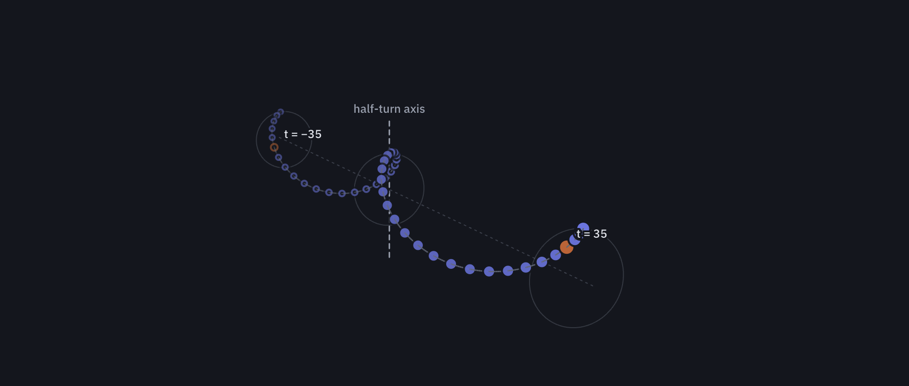

# Atiyah–Sutcliffe Conjecture 1 is false

`AtiyahSutcliffeDisproof.lean` is a single Lean 4 file proving that the Atiyah–Sutcliffe conjecture 1,
as formalised in [google-deepmind/formal-conjectures](https://github.com/google-deepmind/formal-conjectures)
(`AtiyahSutcliffe.conjecture_one` in `FormalConjectures/Arxiv/1102.4662/AtiyahSutcliffe.lean`), is false:

```lean
theorem AtiyahSutcliffe.conjecture_one_false :
    ¬ ∀ {n : ℕ} (x : Fin n → Point), Function.Injective x → LinearIndependent ℂ (pointPolynomial x)
-- depends on axioms: [propext, Classical.choice, Quot.sound]
```

The counterexample has 46 points: the helix points `(sin((2j+1)θ), (2j+1)·b, cos((2j+1)θ))`, `j = 0 … 22`,
with their images under the half-turn `(x, y, z) ↦ (−x, −y, z)`, and one pair moved to a zero of the Schur
residual of the even coefficient block (`tan(θ/2) = a ≈ 0.0685930529198825`, `b ≈ 0.3018996198236849`).
The zero is certified by a Newton–Kantorovich argument in 320-bit interval arithmetic that the Lean kernel
re-evaluates.

## Verify

Toolchain: Lean 4.33.1, Mathlib `v4.33.1` (the pin of formal-conjectures). In a checkout of
formal-conjectures:

```
lake build 'FormalConjectures.Arxiv.«1102.4662».AtiyahSutcliffe'
lake env lean AtiyahSutcliffeDisproof.lean
```

or `FC=/path/to/formal-conjectures ./verify.sh`. The file takes about ten minutes to check (kernel
evaluation of the certificate; peak memory about 16 GB); the last line printed is the axiom list above.

## Contents

The file concatenates the modules of the development that produced it: the lemma library `Atiyah.Facts`
(verified lemmas of the Crucian study that found the witness; statements as generated), then the readable
certificate layer `Atiyah.*`: fixed-point interval arithmetic, dual numbers, the coefficient program,
pivoted elimination, the Newton–Kantorovich check, the witness data and computation, the kernel checks (per
row, from `eval%` snapshots), the enclosure chain to the column dependence, and the final theorems.

# How the counterexample works

This note explains the construction behind `AtiyahSutcliffeDisproof.lean` and how the proof certifies
it.

## 1. The conjecture

Let x<sub>1</sub>, …, x<sub>n</sub> be distinct points in ℝ³. For each ordered pair i ≠ j, the unit
direction from x<sub>i</sub> to x<sub>j</sub> is a point of the sphere S²; stereographic projection
identifies it with a point t<sub>ij</sub> of the Riemann sphere ℂℙ¹. Let p<sub>i</sub> be the binary form
of degree n − 1 whose roots are the t<sub>ij</sub>, j ≠ i:

<p align="center">p<sub>i</sub>(X<sub>0</sub>, X<sub>1</sub>) = ∏<sub>j ≠ i</sub> ℓ<sub>ij</sub>(X<sub>0</sub>, X<sub>1</sub>),</p>

where ℓ<sub>ij</sub> is a linear form vanishing at t<sub>ij</sub>.

**Conjecture 1** (Atiyah 2000; Atiyah–Sutcliffe 2002). For every configuration of distinct points, the
forms p<sub>1</sub>, …, p<sub>n</sub> are linearly independent.

The n forms live in the n-dimensional space of binary forms of degree n − 1, so Conjecture 1 says that
the n × n matrix of their coefficients is non-singular. Suppose each ℓ<sub>ij</sub> is built from a unit
spinor, and antipodal directions are coupled by (α, β) ↦ (−β̄, ᾱ). Then the determinant
D(x<sub>1</sub>, …, x<sub>n</sub>) of this matrix is a well-defined function of the configuration. It is
invariant under rotations, translations and scaling, and D = 1 for collinear points. Atiyah and Sutcliffe
also conjectured:

- **Conjecture 2:** |D| ≥ 1.
- **Conjecture 3:** |D<sub>n</sub>|<sup>n−2</sup> ≥ ∏<sub>i=1…n</sub> |D<sub>n−1</sub><sup>(i)</sup>|, where
  D<sub>n−1</sub><sup>(i)</sup> is the determinant of the configuration without x<sub>i</sub>.

Conjecture 3 implies Conjecture 2 (by induction, starting from D<sub>2</sub> = 1), and Conjecture 2
implies Conjecture 1. Before this work, Conjecture 1 had been proved for n ≤ 4: by Atiyah for n = 3 and by
Eastwood and Norbury for n = 4. Atiyah and Sutcliffe tested Conjecture 2 numerically for n ≤ 20.

The formal statement `AtiyahSutcliffe.conjecture_one` in google-deepmind/formal-conjectures projects from
the north pole (0, 0, 1) and uses the unnormalised lift ((d<sub>0</sub> + i d<sub>1</sub>) / (‖d‖ −
d<sub>2</sub>), 1) of a direction d. Multiplying a polynomial by a non-zero constant does not change linear
independence, so this is the same statement as Conjecture 1.

## 2. Why counterexamples are hard to find

D is a complex number, so D = 0 means two real equations: Re D = 0 and Im D = 0. Its zero set therefore
generically has codimension 2 in the space of configurations. Random configurations never land on it, and
a one-parameter family generically misses it. Moreover, D is a real-analytic function on the connected
space of configurations and equals 1 on collinear ones, so its zeros form a closed set of measure zero. A
zero has to be aimed at, with at least two parameters tuned at the same time.

## 3. The configuration: 46 points on a helix

<p align="center">x<sub>t</sub> = (sin tθ, t·b, cos tθ),&emsp;t ∈ {±1, ±3, …, ±45}.</p>

These are 46 equally spaced points on a circular helix of radius 1 whose axis is the y-axis. From one
point to the next (t → t + 2), the helix turns by 2θ and rises by 2b. The parameters t are odd so that the
points split into pairs {t, −t} and none of them sits at t = 0.



**Figure.** The 46 points in perspective. Filled dots: the 23 base points (t > 0). Hollow dots: their
half-turn images (t < 0). Orange: the pair t = ±35 that the proof moves. Dashed line: the half-turn axis
(§4). Dotted line: the axis of the helix. Circles: the cylinder of radius 1 at both ends and in the middle.

The proof fixes the parameters as rational numbers:

<p align="center">tan(θ/2) = twistNum / 10<sup>76</sup>,&emsp;b = riseNum / 10<sup>75</sup>,</p>

where `twistNum` and `riseNum` are the 75-digit integers in `Atiyah.Certificate`. In decimals,
θ ≈ 0.136971557327614159 and b ≈ 0.301899619823684910. At these values the angle step 2θ is about 15.70°
(about 22.9 points per turn), the 46 points cover about 1.96 turns, the rise per step 2b is about 0.604,
and the total height 90b is about 27.2. The configuration is a long, stretched spring.

The configuration in the proof differs from this helix in two small ways. The x- and z-coordinates are
replaced by exact rationals, the midpoints of the 320-bit intervals that enclose them, while the heights
t·b stay exact. And point 17 (t = 35) and its partner (t = −35) are displaced by at most 10<sup>−40</sup>
(§6).

## 4. The half-turn splits the problem in two

Let R(x, y, z) = (−x, −y, z) be the rotation by π about the z-axis, which passes through the middle of the
helix perpendicular to its axis. R maps x<sub>t</sub> to x<sub>−t</sub>, so it maps the configuration to
itself and swaps the two points of each pair.

The stereographic projection has its pole on the z-axis, which is the axis of R. So R acts on the complex
coordinate of a direction by w ↦ −w. As a result, the linear factor of Rd is, up to sign, the linear factor
of d with X<sub>1</sub> replaced by −X<sub>1</sub>. Since R maps the direction from x<sub>t</sub> to
x<sub>s</sub> to the direction from x<sub>−t</sub> to x<sub>−s</sub>,

<p align="center">p<sub>−t</sub>(X<sub>0</sub>, X<sub>1</sub>) = ± p<sub>t</sub>(X<sub>0</sub>, −X<sub>1</sub>).</p>

Write p<sub>t</sub> = E<sub>t</sub> + O<sub>t</sub>, where E<sub>t</sub> collects the monomials with an
even power of X<sub>1</sub> and O<sub>t</sub> those with an odd power. Then
p<sub>−t</sub> = ±(E<sub>t</sub> − O<sub>t</sub>), so for each pair

<p align="center">span{p<sub>t</sub>, p<sub>−t</sub>} = span{E<sub>t</sub>, O<sub>t</sub>}.</p>

The binary forms of degree 45 split into an even part and an odd part, each of dimension 23. In the basis
of sums and differences of pairs, the 46 × 46 coefficient matrix is block-diagonal:

<p align="center">D = c · det(E<sub>1</sub>, E<sub>3</sub>, …, E<sub>45</sub>) · det(O<sub>1</sub>, O<sub>3</sub>, …, O<sub>45</sub>)</p>

for a non-zero constant c. A linear relation ∑<sub>t</sub> c<sub>t</sub> E<sub>t</sub> = 0 among the even
parts of the 23 base polynomials is therefore a dependence ∑<sub>t</sub> c<sub>t</sub> (p<sub>t</sub> ±
p<sub>−t</sub>) = 0 among all 46 polynomials. The counterexample is a zero of the even 23 × 23 block.

## 5. One number instead of a determinant: the Schur residual

The proof does not compute the determinant of the even block directly. Instead, it reduces the problem
to a single complex number:

1. Take the rows of the even block that belong to the 22 base points other than point 17.
2. Run Gaussian elimination on them with a fixed sequence of pivots.
3. Reduce the row of point 17 against the result.

What is left is one complex number s, the *Schur residual*. If all 22 pivots are non-zero, then s = 0
exactly when the block is singular, and back-substitution turns s = 0 into an explicit linear relation in
the block. Rows and columns are rescaled by fixed powers of two to keep the entries of comparable size.

## 6. From a numerical zero to a proof

The witness was found by a computer search. A computer cannot check that a quantity is exactly zero, only
that it is small, so the proof shows instead that a zero *exists* in a tiny ball. It does this by a
Newton–Kantorovich argument evaluated in rigorous interval arithmetic.

**Exact data.** Because tan(θ/2) is rational, so is

<p align="center">e<sup>iθ</sup> = (1 − a² + 2ia) / (1 + a²),&emsp;a = tan(θ/2),</p>

and the base points are generated by repeated multiplication by e<sup>2iθ</sup>. No trigonometric
functions are evaluated.

**Two unknowns.** The proof keeps θ and b fixed and moves point 17 by (y<sub>0</sub>, 0, y<sub>1</sub>).
Its partner moves by the half-turn image of that displacement, so the symmetry of §4 is kept. Every other
point stays fixed. The unknown is y = (y<sub>0</sub>, y<sub>1</sub>) ∈ ℝ² and the equation is

<p align="center">F(y) = (Re s(y), Im s(y)) = 0.</p>

**The check.** Let r = 10<sup>−40</sup>. Let P be a fixed rational 2 × 2 matrix close to
J(0)<sup>−1</sup>, where J is the Jacobian of F. The Lean kernel verifies the following:

1. ‖P F(0)‖<sub>∞</sub> ≤ r/2.
2. Every row sum of |I − P J(y)| is at most 1/2, for **all** y with ‖y‖<sub>∞</sub> ≤ r. The Jacobian is
   enclosed over the whole ball by running the program on interval dual numbers.
3. All 22 elimination pivots stay away from zero over the whole ball.
4. det P ≠ 0.

Under these conditions, G(y) = y − P F(y) maps the ball into itself, since
‖G(y)‖<sub>∞</sub> ≤ r/2 + ½ ‖y‖<sub>∞</sub> ≤ r. It is also a contraction with constant 1/2. By the
Banach fixed-point theorem it has a fixed point y<sup>∗</sup>, and F(y<sup>∗</sup>) = 0 because P is
invertible.

**Arithmetic.** Numbers are intervals of integers on the scale 2<sup>−320</sup> (about 96 decimal digits).
Division and square roots (`Nat.sqrt`) round outward. Dual numbers carry interval enclosures of the
derivatives with respect to y<sub>0</sub> and y<sub>1</sub>. The coefficient program is written three
times: on real-valued functions of y, on complex intervals and on complex dual intervals. Lemmas prove
that each interval version encloses the real one.

**Kernel evaluation.** Compiled code runs the computation once (`eval%`) and stores its intermediate
results as literals: the 23 constant rows, the even block at the centre and over the ball, and the two
eliminated tables. The kernel then re-checks every stage with `decide +kernel`, row by row, and finally
checks the inequalities above. Nothing relies on trusting the compiler:
`#print axioms AtiyahSutcliffe.conjecture_one_false` reports only `propext`, `Classical.choice` and
`Quot.sound`.

## 7. From the zero to the theorem

The chain of steps is:

- The zero of the residual gives a linear relation in the even block (§5).
- The half-turn lemma turns that relation into a dependence among the 46 polynomials (§4).
- The points are distinct, because their heights t·b are distinct.
- No direction between two points is vertical, so the repository's `directionLift` never takes its
  special-case branch. The raw lift (d<sub>0</sub> + i d<sub>1</sub>, ‖d‖ − d<sub>2</sub>) used in the
  computation differs from it by a non-zero factor.

Together, these contradict `conjecture_one` for n = 46.

## 8. Consequences and open questions

- D = 0 for this configuration, so it violates Conjecture 2 as well. Since Conjecture 3 implies
  Conjecture 2, Conjecture 3 is false too. Neither of them is formalised in formal-conjectures.
- There is no conceptual explanation of why this helix is singular; the zero was found by computer search.
- The smallest counterexample is unknown. Since Conjecture 1 holds for n ≤ 4, it has between 5 and 46
  points.
- Counterexamples are rare: they form a closed set of measure zero, generically of codimension 2.

## References

- M. F. Atiyah, *The geometry of classical particles*, Surveys in Differential Geometry VII (2000).
- M. F. Atiyah, *Configurations of points*, Phil. Trans. R. Soc. Lond. A 359 (2001).
- M. F. Atiyah and P. M. Sutcliffe, *The geometry of point particles*, Proc. R. Soc. Lond. A 458 (2002),
  [arXiv:hep-th/0105179](https://arxiv.org/abs/hep-th/0105179).
- M. Eastwood and P. Norbury, *A proof of Atiyah's conjecture on configurations of four points in
  Euclidean three-space*, Geom. Topol. 5 (2001), [arXiv:math/0109161](https://arxiv.org/abs/math/0109161).
- M. Mazur and B. V. Petrenko, *On the conjectures of Atiyah and Sutcliffe*,
  [arXiv:1102.4662](https://arxiv.org/abs/1102.4662).
- The formal statement:
  [`AtiyahSutcliffe.lean`](https://github.com/google-deepmind/formal-conjectures/blob/main/FormalConjectures/Arxiv/1102.4662/AtiyahSutcliffe.lean)
  in google-deepmind/formal-conjectures, and
  [PR #6966](https://github.com/google-deepmind/formal-conjectures/pull/6966).
